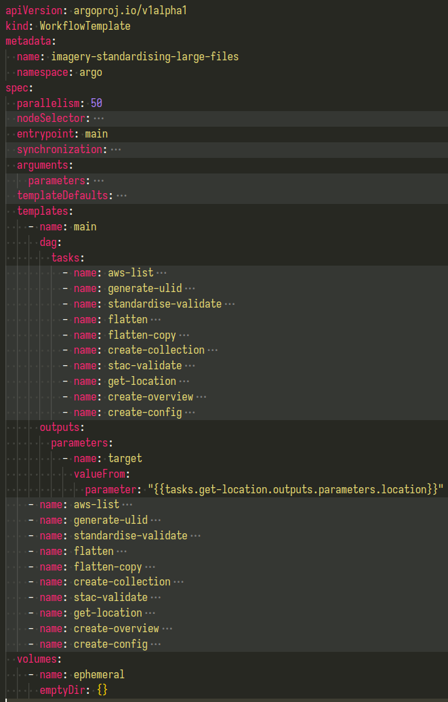

# Argo Workflows Training Workshop

## Workshop Aims

## Workshop Contents

- Introduction to the tech ecosystem: containerisation, Kubernetes, Argo Workflows
- The structure of an Argo workflow; workflow concepts
- Building and running workflows from the UI
- Building and running workflows from the command line
- Monitoring your running workflows - how to view logs and get Kubernetes events
- How the Topo workflows are structured – example using the standardising workflow
- The codebase (containers) behind the Topo workflows
- Running a real world workflow – historical imagery or raster data store workflows
- How to get help from TDE

## Workshop Pre-Requisites

### AWS CLI v2

https://docs.aws.amazon.com/cli/latest/userguide/getting-started-install.html

### Install Git CLI and clone the Topo Workflows GitHub repository

```bash
sudo apt-get update
sudo apt-get install git
git clone https://github.com/linz/topo-workflows.git
```

This will create a copy of the Topo Workflows repository locally.

### `kubectl`

https://kubernetes.io/docs/tasks/tools/

### Argo CLI

https://github.com/argoproj/argo-workflows/releases/

## Argo Workflows, Kubernetes and AWS Elastic Kubernetes Service

[Argo Configuration Guide - Introduction to Argo Workflows](../../CONFIGURATION.md#IntroductiontotheArgoWorkflowsEnvironment)


## What is a workflow?

An workflow is a YAML (or JSON) document that specifies the tasks to be carried out and the settings that should be applied to the workflow and the tasks. The workflow document is submitted to Argo and is scheduled and run using AWS EC2 resources that are dynamically requested and assigned.

## Diagram of workflow structure

> Instructor notes:
>
> Go through each section. Explain this is very simplified and we will look at a more detailed version later on.


## Creating and running workflows

### Running workflows from the UI

> Instructor notes:
>
> Explain the difference between Workflows and Workflow Templates

#### UI "hello world" example

> Instructor notes:
>
> There are simpler ways to do this, but this is more consistent with our workflows. Example: could specify the container in the main template as there is only one task. Also we are going to use DAG and tasks instead of steps.

Create a new file called `wf_helloworld.yaml` containing the following YAML:

```yaml
apiVersion: argoproj.io/v1alpha1
kind: Workflow
metadata:
  generateName: test-name-hello-world-
  namespace: argo
spec:
  entrypoint: main
  arguments:
    parameters:
      - name: message
        value: "hello world"
  templates:
    - name: main
      dag:
        tasks:
          - name: say-hello-task
            template: say-hello-template
            arguments:
              parameters:
                - name: message
                  value: "{{workflow.parameters.message}}"
    - name: say-hello-template
      inputs:
        parameters:
          - name: message
      container:
        image: "019359803926.dkr.ecr.ap-southeast-2.amazonaws.com/eks:topo-imagery-v1"
        command: [echo]
        args: ["{{inputs.parameters.message}}"]
```

Submit the workflow through the UI.

#### "hello world" example with argument parameter

> Instructor notes:
>
> Show how the parameters are passed through the workflow

Create a new file called `wf_helloworld_args.yaml` containing the following YAML:

```yaml
apiVersion: argoproj.io/v1alpha1
kind: Workflow
metadata:
  generateName: test-name-hello-world-
  namespace: argo
spec:
  entrypoint: main
  arguments:
    parameters:
      - name: message
        value: "hello world"
  templates:
    - name: main
      dag:
        tasks:
          - name: say-hello-task
            template: say-hello-template
            arguments:
              parameters:
              - name: message
                  value: "{{workflow.parameters.message}}"
    - name: say-hello-template
      inputs:
        parameters:
          - name: message
      container:
        image: "019359803926.dkr.ecr.ap-southeast-2.amazonaws.com/eks:topo-imagery-v1"
        command: [echo]
        args: ["{{inputs.parameters.message}}"]
```

#### UI "hello world" example with arguments containing two tasks

> Instructor notes:
>
> This workflow will run two tasks at the same time. Go through it with workshop attendees. In this case we are using the same "say-hello-template" template. These tasks could reference different templates.

Add another step to `wf_helloworld_args.yaml` and another parameter for it.

```yaml
apiVersion: argoproj.io/v1alpha1
kind: Workflow
metadata:
  generateName: test-name-hello-world-
  namespace: argo
spec:
  entrypoint: main
  arguments:
    parameters:
      - name: message1
        value: "hello world 1"
      - name: message2
        value: "hello world 2"
  templates:
    - name: main
      dag:
        tasks:
          - name: say-hello-task1
            template: say-hello-template
            arguments:
              parameters:
                - name: message
                  value: "{{workflow.parameters.message1}}"
          - name: say-hello-task2
            template: say-hello-template
            arguments:
              parameters:
                - name: message
                  value: "{{workflow.parameters.message2}}"
    - name: say-hello-template
      inputs:
        parameters:
          - name: message
      container:
        image: "019359803926.dkr.ecr.ap-southeast-2.amazonaws.com/eks:topo-imagery-v1"
        command: [echo]
        args: ["{{inputs.parameters.message}}"]
```

Submit the workflow through the UI.

#### DAG example - dependent tasks

> Instructor notes:
>
> Running tasks in order using dependencies. Fan in, fan out.

```yaml
apiVersion: argoproj.io/v1alpha1
kind: Workflow
metadata:
  generateName: test-name-hello-world-
  namespace: argo
spec:
  entrypoint: main
  arguments:
    parameters:
      - name: message1
        value: "hello world 1"
      - name: message2
        value: "hello world 2"
  templates:
    - name: main
      dag:
        tasks:
          - name: say-hello-task1
            template: say-hello-template
            arguments:
              parameters:
                - name: message
                  value: "{{workflow.parameters.message1}}"
          - name: say-hello-task2
            template: say-hello-template
            arguments:
              parameters:
                - name: message
                  value: "{{workflow.parameters.message2}}"
            depends: "say-hello-task1"
          - name: say-hello-task3
            template: say-hello-template
            arguments:
              parameters:
                - name: message
                  value: "say hello task 3"
            depends: "say-hello-task1"
          - name: say-hello-task4
            template: say-hello-template
            arguments:
              parameters:
                - name: message
                  value: "say hello task 4"
            depends: "say-hello-task2 && say-hello-task3"
    - name: say-hello-template
      inputs:
        parameters:
          - name: message
      container:
        image: "019359803926.dkr.ecr.ap-southeast-2.amazonaws.com/eks:topo-imagery-v1"
        command: [echo]
        args: ["{{inputs.parameters.message}}"]
```

> Instructor notes:
>
> Fanning in and fanning out. Power of Argo Workflows - can automate this to create multiple parallel tasks

## Creating and running workflows from the CLI

### CLI "hello world" example

`argo submit docs/training/wf_helloworld.yaml -n argo --watch`

#### CLI "hello world" example with argument parameters

`argo submit docs/training/wf_helloworld_args.yaml -n argo p message1="hello world" --watch`

## Inputs and Outputs - passing information between tasks in a Workflow

## How the Topo workflows are structured – example using the standardising workflow



## Referencing other Workflows

## The codebase and containers behind the Topo workflows

### Topo Workflows

### Topo Imagery

### Argo Tasks

### Basemaps-cli

## Running a real world workflow – historical imagery or raster data store workflows

## How to get help from TDE

> Move further down

```yaml
apiVersion: argoproj.io/v1alpha1
kind: Workflow
metadata:
  generateName: test-name-hello-world-parameters-
spec:
  entrypoint: main
  arguments:
    parameters:
      - name: message1
        value: "hello world 1"
      - name: message2
        value: "hello world 2"
  templates:
    - name: main
      steps:
        - name: task1
          template: whalesay
          arguments:
            parameters:
              [{ name: message, value: "{{workflow.parameters.message1}}" }]
        - name: task2
          template: whalesay
          arguments:
            parameters:
              [{ name: message, value: "{{workflow.parameters.message2}}" }]
    - name: whalesay
      inputs:
        parameters:
          - name: message
      container:
        image: docker/whalesay:latest
        command: [cowsay]
        args: ["{{inputs.parameters.message}}"]
```
