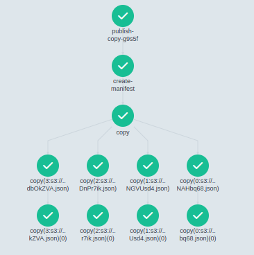
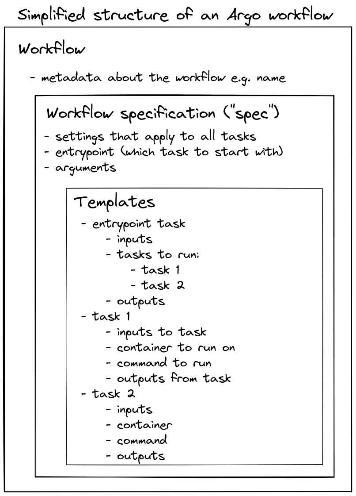

# Argo Workflows Training Workshop

## Workshop Aims

## Workshop Contents

- Getting help from TDE
- Introduction to the tech ecosystem: containerisation, Kubernetes, Argo Workflows
- The structure of an Argo workflow; workflow concepts
- The codebase and containers behind the Topo workflows
- Creating and running workflows from the UI
- Creating and running workflows from the command line
- Monitoring your running workflows - how to view logs and get Kubernetes events
- How the Topo workflows are structured – example using the standardising workflow
- Other features
- The codebase (containers) behind the Topo workflows

## Workshop Pre-Requisites

### AWS CLI v2

[https://docs.aws.amazon.com/cli/latest/userguide/getting-started-install.html](https://docs.aws.amazon.com/cli/latest/userguide/getting-started-install.html)

### Install Git CLI and clone the Topo Workflows GitHub repository

```bash
sudo apt-get update
sudo apt-get install git
git clone https://github.com/linz/topo-workflows.git
```

This will create a copy of the Topo Workflows repository locally.

### `kubectl`

[https://kubernetes.io/docs/tasks/tools/](https://kubernetes.io/docs/tasks/tools/)

### Argo CLI

[https://github.com/argoproj/argo-workflows/releases/](https://github.com/argoproj/argo-workflows/releases/)

## Getting help from TDE

Ask on the `#team=topo-data-engineering` Slack channel :smile:

If you have a question about a particular Workflow that has run on Argo, you can tag `@squad-de-dev` in the relevant thread in the `#alert-argo-workflows` Slack channel.

## Introduction to the tech ecosystem: containerisation, Argo Workflows, Kubernetes and AWS Elastic Kubernetes Service

A workflow running in Argo:



The infrastructure running Argo Workflows:


For more in-depth information, see:
[Argo Configuration Guide - Introduction to Argo Workflows](../../CONFIGURATION.md#IntroductiontotheArgoWorkflowsEnvironment)

## What is a Workflow?

A workflow is a grouping of tasks to be run. It is a YAML (or JSON) document that specifies the tasks to be carried out and the settings that should be applied to the workflow and the tasks. The workflow document is submitted to Argo and is scheduled and run using AWS EC2 resources that are dynamically requested and assigned.

Workflow concepts (see diagram below):

- Workflow
- WorkflowSpec
- Templates (e.g. container, script)
- Template Invocators (e.g. dag: task)



This diagram is simplified and we will look at a more detailed, real-world, example later on.

## The codebase and containers behind the Topo workflows

Templates specify a container image to use, which a pod will run in.

All the examples in this workshop will use our Topo containers.

| **Container**                                                                    | **Purpose**                                                                       |
| -------------------------------------------------------------------------------- | --------------------------------------------------------------------------------- |
| [topo-imagery](https://github.com/linz/topo-imagery/pkgs/container/topo-imagery) | Python scripts that need to use the GDAL library and geospatial Python libraries. |
| [argo-tasks](https://github.com/linz/argo-tasks/pkgs/container/argo-tasks)       | Reusable utility tasks written in TypeScript.                                     |
| [basemaps-cli](https://github.com/linz/basemaps/pkgs/container/basemaps%2Fcli)   | Controls Basemaps configuration.                                                  |

## Creating and running workflows

### Running workflows from the UI

A note: `Workflows` and `WorkflowTemplates`.

We are working with documents of the kind "Workflow" in this workshop. Workflows can be submitted directly, or can be submitted using a "WorkflowTemplate". This is useful for Workflows that will run with different parameters but are otherwise running the same tasks.

#### UI "hello world" example

There are simpler ways to do this, but this is more consistent with our workflows. For example: we could specify the container in the main template as there is only one task.

Also, we are going to use DAG (directed acyclic graph) and "tasks", instead of "steps". Steps are similar to using dag/tasks, but not as flexible, taking the form of a list of lists.

Create a new file called `wf_helloworld.yaml` containing the following YAML:

```yaml
---
apiVersion: argoproj.io/v1alpha1
kind: Workflow
metadata:
  generateName: test-name-hello-world-
  namespace: argo
spec:
  entrypoint: main
  templates:
    - name: main
      dag:
        tasks:
          - name: say-hello-step
            template: say-hello-template
    - name: say-hello-template
      container:
        image: "019359803926.dkr.ecr.ap-southeast-2.amazonaws.com/eks:topo-imagery-v1"
        command: [echo]
        args: ["hello world"]
```

`wf_helloworld.yaml`

Submit the workflow through the UI.

#### "hello world" example with argument parameter

Parameters are passed through from the workflow spec to the templates.

Create a new file called `wf_helloworld_args.yaml` containing the following YAML:

```yaml
---
apiVersion: argoproj.io/v1alpha1
kind: Workflow
metadata:
  generateName: test-name-hello-world-
  namespace: argo
spec:
  entrypoint: main
  arguments:
    parameters:
      - name: message
        value: "hello world"
  templates:
    - name: main
      dag:
        tasks:
          - name: say-hello-task
            template: say-hello-template
            arguments:
              parameters:
              - name: message
                  value: "{{workflow.parameters.message}}"
    - name: say-hello-template
      inputs:
        parameters:
          - name: message
      container:
        image: "019359803926.dkr.ecr.ap-southeast-2.amazonaws.com/eks:topo-imagery-v1"
        command: [echo]
        args: ["{{inputs.parameters.message}}"]
```

`wf_helloworld_args.yaml`

### Creating and running workflows from the CLI

In a terminal window, log in to `li-topo-prod` using AWS CLI.

Check your connection to Argo:

```bash
kubectl get pods -n argo
argo list -n argo
```

In the above commands, `-n argo` means specify the argo "namespace". This is a way of separating Kubernetes pods into different areas. In our environment, these are only used for functions of the infrastructure, e.g. server functions or monitoring. You can try the commands with the option `-A` to specify all namespaces instead of `-n argo` and see which other pods are running.

For Argo CLI, you can set the environment variable `ARGO_NAMESPACE=argo` so you don’t have to specify the namespace in your argo commands.

You can also do that for kubectl if you want to:
`kubectl config set-context --current --namespace=argo`

#### CLI "hello world" example

`argo submit docs/training/wf_helloworld.yaml -n argo --watch`

#### CLI "hello world" example with argument parameters

`argo submit docs/training/wf_helloworld_args.yaml p message1="hello world" --watch`

> **_Resources:_** [Argo CLI documentation](https://argoproj.github.io/argo-workflows/cli/argo/) - [Kubernetes Cheat Sheet](https://kubernetes.io/docs/reference/kubectl/cheatsheet/)

#### Monitoring your running workflows - how to view logs and get events

##### Slack

Some generic and specific alerts have been configured to happen in `#alert-argo-workflows`:

- Workflow Started/Completed/Failed
- Non Visual QA report / Basemaps links

##### Argo UI

The application logs are accessible in the Argo UI Workflow page in the task description (by clicking on one of the task/pod - `SUMMARY` tab):


They are also downloadable in the `INPUTS/OUTPUTS` tab as `main.log`.

##### Pod

You can view the logs for a pods in "live" with the following command:

```bash
kubectl logs POD_NAME -n NAMESPACE --follow
```

##### Kubernetes events

Events represent a state change of a k8s resource (examples: `Pod CREATED`, `Container PULLED` or `WorkflowRunning`). The events are available during 60 minutes with the following command:

```bash
kubectl get events -n argo
```

Some filters can be applied:

- `--sort-by=.metadata.creationTimestamp` to sort them in chronological order
- `--types=Warning` to show only the warnings
  Older events (more than 60 minutes) are still available in Elastic Search (see next section).

##### Elastic Search

The logs and events that are output by the Argo Workflows ecosystem are accessible inside Elastic Search. Elastic Search allows the user to execute queries. It contains application logs and system events at the same place.

#### UI "hello world" example with arguments containing two tasks

This workflow will run two tasks at the same time. In this case we are using the same "say-hello-template" template. These tasks could reference different templates.

Add another task to `wf_helloworld_args.yaml` and another parameter for it.

```yaml
---
apiVersion: argoproj.io/v1alpha1
kind: Workflow
metadata:
  generateName: test-name-hello-world-
  namespace: argo
spec:
  entrypoint: main
  arguments:
    parameters:
      - name: message1
        value: "hello world 1"
      - name: message2
        value: "hello world 2"
  templates:
    - name: main
      dag:
        tasks:
          - name: say-hello-task1
            template: say-hello-template
            arguments:
              parameters:
                - name: message
                  value: "{{workflow.parameters.message1}}"
          - name: say-hello-task2
            template: say-hello-template
            arguments:
              parameters:
                - name: message
                  value: "{{workflow.parameters.message2}}"
    - name: say-hello-template
      inputs:
        parameters:
          - name: message
      container:
        image: "019359803926.dkr.ecr.ap-southeast-2.amazonaws.com/eks:topo-imagery-v1"
        command: [echo]
        args: ["{{inputs.parameters.message}}"]
```

`wf_helloworld_args_tasks.yaml`

Submit the workflow through the CLI.

### DAG example - dependent tasks

```yaml
---
apiVersion: argoproj.io/v1alpha1
kind: Workflow
metadata:
  generateName: test-name-hello-world-dag-
  namespace: argo
spec:
  entrypoint: main
  arguments:
    parameters:
      - name: message1
        value: "hello world 1"
      - name: message2
        value: "hello world 2"
  templates:
    - name: main
      dag:
        tasks:
          - name: say-hello-task1
            template: say-hello-template
            arguments:
              parameters:
                - name: message
                  value: "{{workflow.parameters.message1}}"
          - name: say-hello-task2
            template: say-hello-template
            arguments:
              parameters:
                - name: message
                  value: "{{workflow.parameters.message2}}"
            depends: "say-hello-task1"
          - name: say-hello-task3
            template: say-hello-template
            arguments:
              parameters:
                - name: message
                  value: "say hello task 3"
            depends: "say-hello-task1"
          - name: say-hello-task4
            template: say-hello-template
            arguments:
              parameters:
                - name: message
                  value: "say hello task 4"
            depends: "say-hello-task2 && say-hello-task3"
    - name: say-hello-template
      inputs:
        parameters:
          - name: message
      container:
        image: "019359803926.dkr.ecr.ap-southeast-2.amazonaws.com/eks:topo-imagery-v1"
        command: [echo]
        args: ["{{inputs.parameters.message}}"]
```

`wf_helloworld_dag.yaml`

### Inputs and Outputs - passing information between tasks in a Workflow

The outputs of one task can be passed as inputs to other tasks using parameters, artifacts, or custom code.

### Parallelising a task to run in multiple pods

The example below uses "item" to run pods in parallel. "Item" expands a single workflow task into multiple parallel steps using a list output from a previous task. It also passes the output from the `aws-list` task to the `stac-print-path` task.

```yaml
---
apiVersion: argoproj.io/v1alpha1
kind: Workflow
metadata:
  generateName: test-output-parallel-
spec:
  parallelism: 20
  nodeSelector:
    karpenter.sh/capacity-type: "spot"
  serviceAccountName: workflow-runner-sa
  entrypoint: main
  arguments:
    parameters:
      - name: uri
        value: "s3://linz-imagery-staging/test/stac-validate/"
  templateDefaults:
    container:
      imagePullPolicy: Always
  templates:
    - name: main
      dag:
        tasks:
          - name: aws-list
            template: aws-list
            arguments:
              parameters:
                - name: uri
                  value: "{{workflow.parameters.uri}}"
                - name: include
                  value: "json$"
          - name: stac-print-path
            template: stac-print-path
            arguments:
              parameters:
                - name: file
                  value: "{{item}}"
            depends: "aws-list"
            withParam: "{{tasks.aws-list.outputs.parameters.files}}"
    - name: aws-list
      inputs:
        parameters:
          - name: uri
          - name: include
      container:
        image: "019359803926.dkr.ecr.ap-southeast-2.amazonaws.com/eks:argo-tasks-v2"
        command: [node, /app/index.js]
        env:
          - name: AWS_ROLE_CONFIG_PATH
            value: s3://linz-bucket-config/config.json
        args:
          [
            "list",
            "--verbose",
            "--include",
            "{{inputs.parameters.include}}",
            "--group",
            "4",
            "--output",
            "/tmp/file_list.json",
            "{{inputs.parameters.uri}}",
          ]
      outputs:
        parameters:
          - name: files
            valueFrom:
              path: /tmp/file_list.json
    - name: stac-print-path
      inputs:
        parameters:
          - name: file
      script:
        image: "019359803926.dkr.ecr.ap-southeast-2.amazonaws.com/eks:argo-tasks-v2"
        env:
          - name: AWS_ROLE_CONFIG_PATH
            value: s3://linz-bucket-config/config.json
        command:
          - "bash"
        source: |
          PATH_OUT=$(echo "{{inputs.parameters.file}}" | sed 's/,/ /g; s/\[/ /g; s/\]/ /g')
          echo $PATH_OUT
```

`wf_output_parallel.yaml`

## A Workflow example: standardising workflow

General structure:


Go through the Standardising YAML file in more detail - any questions?

## Other features to note (beyond the scope of this Workshop)

- Artifacts
- Conditionals
- Referencing other Workflows/WorkflowTemplates
- Sprig

** link to the training modules **
