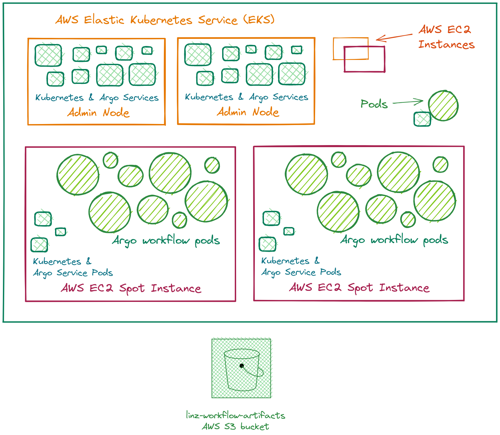

# Argo Workflows Training Workshop

## Workshop Aims:


## Workshop Contents:

- Introduction to the tech ecosystem: containerisation, Kubernetes, Argo Workflows
- The structure of an Argo workflow; workflow concepts
- Building and running workflows from the UI (hello world, GDAL command)
- Building and running workflows from the command line (hello world, GDAL command)
- Monitoring your running workflows - how to view logs and get Kubernetes events
- How the Topo workflows are structured – example using the standardising workflow
- The codebase (containers) behind the Topo workflows
- Running a real world workflow – historical imagery or raster data store workflows
- How to get help from TDE


## Workshop Pre-Requisites:

### AWS CLI v2

https://docs.aws.amazon.com/cli/latest/userguide/getting-started-install.html

### Install Git CLI and clone the Topo Workflows GitHub repository

```bash
sudo apt-get update
sudo apt-get install git
git clone https://github.com/linz/topo-workflows.git
```

This will create a copy of the Topo Workflows repository locally.

### `kubectl`

https://kubernetes.io/docs/tasks/tools/

### Argo CLI

https://github.com/argoproj/argo-workflows/releases/


## Argo Workflows, Kubernetes and AWS Elastic Kubernetes Service

[Argo Configuration Guide - Introduction to Argo Workflows](../../CONFIGURATION.md#IntroductiontotheArgoWorkflowsEnvironment)





## What is a workflow?

An Argo Tasks workflow is a YAML (or JSON) document that specifies the steps/tasks to be carried out and the settings that should be applied to the workflow and the tasks.

## Diagram of workflow structure


## Creating and running workflows

### "hello world" example

#### Running workflow from the UI
#### Running workflows from the CLI

```yaml
apiVersion: argoproj.io/v1alpha1
kind: Workflow
metadata:
  generateName: test-name-hello-world-
  labels:
    workflows.argoproj.io/archive-strategy: "false"
  annotations:
    workflows.argoproj.io/description: |
      This is a simple hello world example.
spec:
  entrypoint: whalesay
  templates:
  - name: whalesay
    container:
      image: docker/whalesay:latest
      command: [cowsay]
      args: ["hello world"]
```

### DAG example

#### Running workflow from the UI
#### Running workflows from the CLI

```yaml
# The following workflow executes a diamond workflow
#
#   A
#  / \
# B   C
#  \ /
#   D
apiVersion: argoproj.io/v1alpha1
kind: Workflow
metadata:
  generateName: test-name-dag-diamond-
spec:
  entrypoint: diamond
  templates:
  - name: diamond
    dag:
      tasks:
      - name: A
        template: echo
        arguments:
          parameters: [{name: message, value: A}]
      - name: B
        depends: "A"
        template: echo
        arguments:
          parameters: [{name: message, value: B}]
      - name: C
        depends: "A"
        template: echo
        arguments:
          parameters: [{name: message, value: C}]
      - name: D
        depends: "B && C"
        template: echo
        arguments:
          parameters: [{name: message, value: D}]

  - name: echo
    inputs:
      parameters:
      - name: message
    container:
      image: "019359803926.dkr.ecr.ap-southeast-2.amazonaws.com/eks:topo-imagery-v1"
      command: [echo, "{{inputs.parameters.message}}"]
```

## Creating and running workflows from the CLI

(mention parameters)
(steps and dags)

### "hello world" example

### DAG example


## The difference between Workflows and WorkflowTemplates

## How the Topo workflows are structured – example using the standardising workflow


## Referencing other Workflows


## The codebase and containers behind the Topo workflows

### Topo Workflows

### Topo Imagery

### Argo Tasks

### Basemaps-cli


## Running a real world workflow – historical imagery or raster data store workflows

## How to get help from TDE
